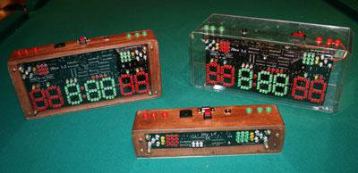

# JBox: Fencing Scoring Machine

PCB schematics and micro-controller code for a version of the scoring apparatus used in competitive fencing and a compatible remote control.

[Original SourceForge Project](https://sourceforge.net/projects/fencingbox/)

## Features

 - PCB design to build a fencing box with(JBox) and without(IBox) score trackers
 - C microcontroller code for controlling the fencing box
 - C microcontroller code for controlling a remote control
 - A PC application for modifying timings and displaying scores on a larger screen
 
